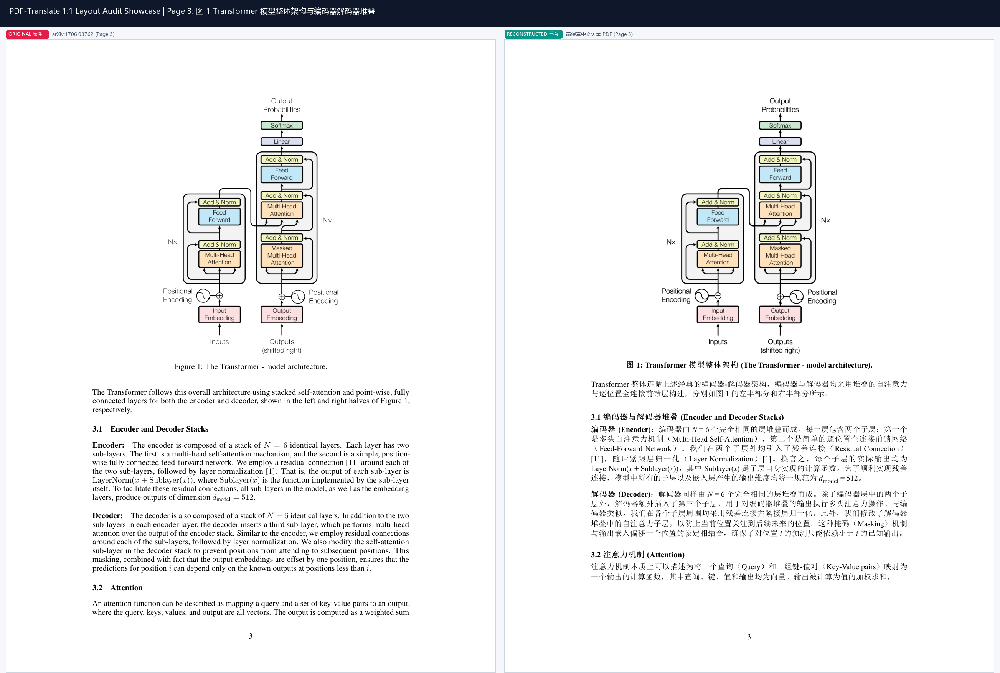
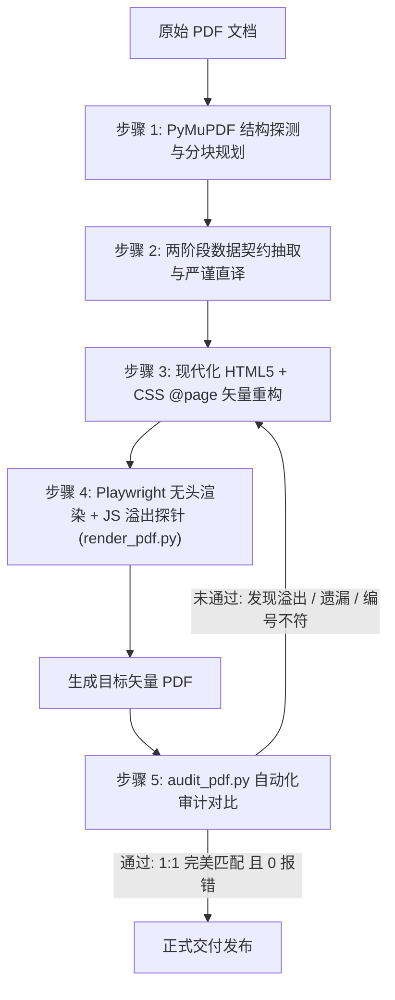

<p align="center">
  <b>简体中文</b> | <a href="README_EN.md">English</a>
</p>

# 📄 PDF-Translate Skill

> **High-Fidelity Vector PDF Translation, Layout Reconstruction & Automated Audit Engine for AI Agents.**  
> 基于大语言模型直译、矢量排版重构、浏览器溢出探针与自动化双向对比自愈的高保真 PDF 翻译技能。

[](https://github.com/lxsssssss/pdf-translate/actions/workflows/ci.yml)
[](LICENSE)
[](https://www.python.org/)
[](https://playwright.dev/)
[](https://pymupdf.readthedocs.io/)

[](https://antigravity.google)
[](https://claude.ai)
[](https://cursor.com)
[](https://codeium.com/windsurf)
[](https://openai.com)
[](https://github.com/lxsssssss/pdf-translate)
[](https://deepseek.com)

---

## 📸 效果对比展示 (Before & After Showcase)

> **实测案例**：现代深度学习与大模型开山之作《Attention Is All You Need》（arXiv:1706.03762），包含多作者机构矩阵、精准边栏学术水印、双栏摘要、数学脚注及严格版面限高。

### 1. 顶会学术论文封面与双栏排版 1:1 还原 (Paper Cover & Dual-Column Layout)


### 2. 复杂模型架构图与物理点位 1:1 精准锚定 (Figure 1 Architecture & Physical Anchors)


---

## 🌟 核心痛点与解决方案 (Why PDF-Translate?)

传统的文档翻译工具（如通用机翻、常规 OCR 导出）在面对**工程标书、跨国商务合同、法定资质证书、学术白皮书**等严肃公文时，常常面临四大致命难题：

1. **版面坍塌**：表格错位、签章栏截断、页码漂移、目录点线混乱。
2. **位图失真**：将文字光栅化为低分辨率图片，导致无法检索复制、模糊不清。
3. **AI 幻觉脑补**：长文本模型擅自“归纳升华”、擅增/缩减子条款编号或脑补不存在的数字。
4. **跨页溢出**：翻译后的中英文文本长度差异撑爆页面物理高度，导致打印机额外产生空页或乱页。

**`pdf-translate`** 专为解决上述痛点而生，结合大模型精准语义提取与前端 CSS 矢量打印控制，确保翻译结果达到**正式出版与官方公文交付级标准**。

---

## 🚀 核心特性 (Key Features)

- 🎯 **1:1 原版排版还原 (1:1 Layout Preservation)**
  - 严格保持页面尺寸（标准 A4、Letter 等）、物理边距与布局比例。
  - 精准重建双语对照表格、官方公文双栏表头、目录点线对齐（Dotted Leaders）及签字盖章框。
- 🚫 **零幻觉与两阶段解耦规范 (Zero Hallucination Pipeline)**
  - **阶段 1（结构化契约）**：按页先提取条款树、数值、参数与表格结构。
  - **阶段 2（模板化填装）**：严禁压缩、省略或凭常识脑补条款（如法定资质清单 2.1.1~2.1.8）。
- 📐 **浏览器物理高度溢出探针 (JS Height Overflow Probe)**
  - 在无头渲染阶段注入 JavaScript 探针，实时检测每个 `.page` 容器的 `scrollHeight` 与 `clientHeight`。
  - 自动拦截并报警任何可能导致分页错乱的微小溢出。
- 🖨️ **纯矢量无损 PDF 重构 (Publication-Grade Vector PDF)**
  - 基于 Chromium / Edge 内核，输出全矢量、可选中、可搜索、超高清的工业级 PDF。
- 🔍 **自动化对比审计引擎 (`scripts/audit_pdf.py`)**
  - **页数匹配校验**：源文件与目标文件总页数严格 1:1。
  - **纯矢量层校验**：杜绝整页截图/位图伪装。
  - **条款编号逐页双向 Diff**：自动比对章节编号与子条款差集。
  - **敏感词与占位符扫描**：自动拦截 “待补充”、“因篇幅省略”、“详见英文原版” 等 AI 偷懒占位符。

---

## 🏗️ 架构与工作流 (Architecture & Workflow)



---

## 📂 项目结构 (Repository Structure)

```text
pdf-translate/
├── .github/
│   ├── workflows/ci.yml     # 自动化 CI 测试工作流
│   └── ISSUE_TEMPLATE/      # 社区 Bug 与 Feature 规范模板
├── SKILL.md                 # Antigravity / AI Agent 核心技能指令与约束规范 (中文版)
├── SKILL_EN.md              # Core Skill Definition & Zero-Hallucination SOP (English Version)
├── requirements.txt         # 核心 Python 依赖项
├── LICENSE                  # MIT 开源协议
├── README.md                # 简体中文说明文档
├── README_EN.md             # English Documentation
├── assets/                  # 官方公文 1:1 真实案例对比图
├── examples/                # 开箱即测示例与一键体验脚本
│   ├── sample_doc.html      # 包含双语公文表头、表格与签章的标准 A4 测试模板
│   └── quick_demo.py        # 一键端到端「Playwright 渲染 + 自动化审计」测试脚本
└── scripts/
    ├── audit_pdf.py         # 1:1 页对页结构、条款双向 Diff 与敏感词自动化审计引擎
    └── render_pdf.py        # 基于 Playwright 的高保真矢量 PDF 渲染脚本 (内置 JS 溢出探针)
```

---

## 🛠️ 安装与快速上手 (Installation & Quick Start)

### 1. 安装依赖

```bash
git clone https://github.com/lxsssssss/pdf-translate.git
cd pdf-translate

pip install -r requirements.txt
playwright install chromium
```

> *注：Windows 环境下亦支持直接调用系统自带的 `msedge` 浏览器信道。*

---

### 2. 运行一键开箱即测 Demo

无需准备任何复杂环境，直接运行项目内置的端到端体验脚本：

```bash
python examples/quick_demo.py
```

终端将依次执行：调用 Playwright 渲染矢量 PDF ➔ 触发 JS 页面高度防溢出探针 ➔ 执行 PyMuPDF 纯矢量层与条款一致性审计 ➔ 输出绿标 PASS 报告！

---

### 3. 命令行工具使用指南

#### 🔹 矢量 PDF 渲染 (`render_pdf.py`)

将排版好的 HTML 源码渲染为物理隔离的矢量 PDF：

```bash
# 基础渲染
python scripts/render_pdf.py input.html output.pdf

# 开启严格模式 (若检测到任何页面高度溢出则立即抛出异常阻断)
python scripts/render_pdf.py input.html output.pdf --strict-overflow
```

#### 🔹 自动化 1:1 对比审计 (`audit_pdf.py`)

比对原版 PDF 与翻译后 PDF 的页码、矢量层、条款编号与文本完整性：

```bash
# 基础对比审计
python scripts/audit_pdf.py --src original.pdf --tgt translated.pdf

# 严格模式 (任何警告均触发非零返回码)
python scripts/audit_pdf.py --src original.pdf --tgt translated.pdf --strict

# 输出结构化 JSON 审计报告 (便于 CI/CD 或 Agent 自动化解析)
python scripts/audit_pdf.py --src original.pdf --tgt translated.pdf --json-out audit_report.json
```

---

## 🌐 多平台 AI 助手原生兼容 (Multi-Platform Ecosystem)

本项目设计为**跨平台、零依赖摩擦的通用 Agent 技能**，原生兼容目前主流 AI 编程助手与大模型智能体环境：

| 平台 / 工具 | 部署路径 / 形式 | 核心支持说明 |
| :--- | :--- | :--- |
| **Google Antigravity** | `.agent/skills/pdf-translate/` | 原生 Skill 识别，自动探测与 5 步 SOP 闭环 |
| **Claude Code** | `.claude/skills/pdf-translate/` 或全局规则 | 遵循 `SKILL_EN.md` 规则与两阶段零幻觉契约 |
| **Cursor** | `.cursorrules` 或 `.cursor/rules/` | 代码生成严格遵循 `@page` 限高与纯矢量布局 |
| **Windsurf (Cascade)** | `.windsurfrules` | 自动化调用 `render_pdf.py` 与 `audit_pdf.py` 自愈 |
| **OpenAI Codex** | Custom Instructions / Action | 结构化数据提取 + 模板化填充双阶段工作流 |
| **WorkBuddy** | 智能体工作流 / 技能中心插件 | 商务公文、外贸标书 1:1 翻译自动化作业 |
| **DeepSeek (V3 / R1)** | 系统提示词 (System Prompt) | 深度推理提取条款树，严禁虚构与脑补条款 |

---

### 💻 各平台快速接入指南

#### 1. Google Antigravity
直接将本项目拷贝至工作区的 `.agent/skills/pdf-translate` 目录下：
```text
your-project/
└── .agent/
    └── skills/
        └── pdf-translate/
            ├── SKILL.md
            ├── SKILL_EN.md
            └── scripts/
```
在会话中提示 **“帮我把这份文件翻译为中文，保持原排版并输出为 PDF”**，Agent 将自动激活该 Skill 并执行闭环工作流。

#### 2. Claude Code
将 `SKILL_EN.md` 导入 Claude 项目自定义指令或配置为专属技能：
```bash
claude config add-skill pdf-translate ./SKILL_EN.md
```

#### 3. Cursor & Windsurf
本项目根目录已内置配置好的 [`.cursorrules`](.cursorrules) 与 [`.windsurfrules`](.windsurfrules)，直接打开本项目所在目录即可自动生效；或将规则内容直接复制进你现有工程的全局规则中。

#### 4. DeepSeek / OpenAI Codex / WorkBuddy
将 `SKILL.md`（或 `SKILL_EN.md`）核心铁律与 SOP 粘贴为 Agent 系统的 System Prompt，并开放 Python 终端权限以供调用 `scripts/render_pdf.py` 与 `scripts/audit_pdf.py`。

---

## 📈 Star History

<a href="https://star-history.com/#lxsssssss/pdf-translate&Date">
 <picture>
   <source media="(prefers-color-scheme: dark)" srcset="https://api.star-history.com/svg?repos=lxsssssss/pdf-translate&type=Date&theme=dark" />
   <source media="(prefers-color-scheme: light)" srcset="https://api.star-history.com/svg?repos=lxsssssss/pdf-translate&type=Date" />
   
 </picture>
</a>

---

## 📄 开源许可证 (License)

本项目采用 [MIT 许可证](LICENSE)。
