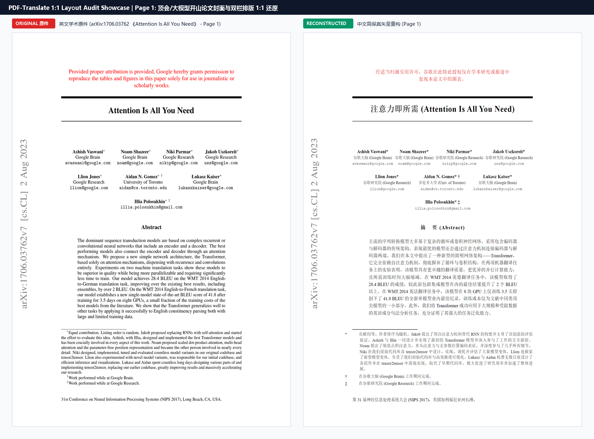
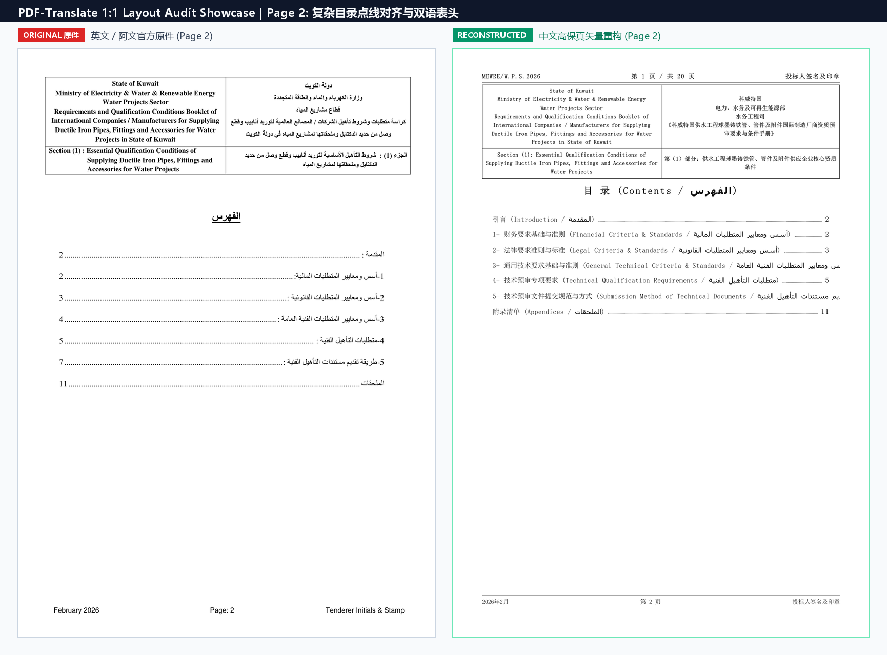
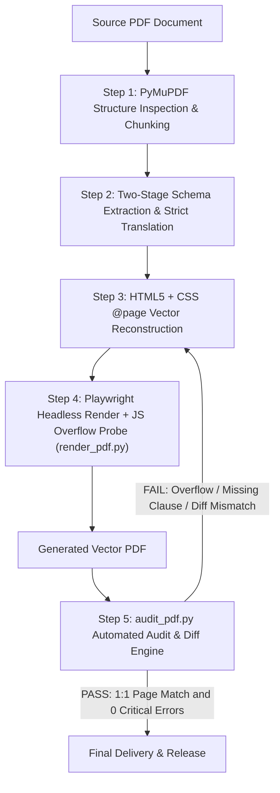

<p align="center">
  <a href="README.md">简体中文</a> | <b>English</b>
</p>

# 📄 PDF-Translate Skill

> **High-Fidelity Vector PDF Translation, Layout Reconstruction & Automated Audit Engine for AI Agents.**  
> Powered by LLM direct comprehension, two-stage data-contract translation, in-browser physical height overflow detection, and automated 1:1 bidirectional page audit.

[](https://github.com/lxsssssss/pdf-translate/actions/workflows/ci.yml)
[](LICENSE)
[](https://www.python.org/)
[](https://playwright.dev/)
[](https://pymupdf.readthedocs.io/)

[](https://antigravity.google)
[](https://claude.ai)
[](https://cursor.com)
[](https://codeium.com/windsurf)
[](https://openai.com)
[](https://github.com/lxsssssss/pdf-translate)
[](https://deepseek.com)

---

## 📸 Before & After Showcase

> **Real-World Case Study**: Official Procurement & Prequalification Booklet for Water Engineering (Middle East MEWRE official government tender), featuring multilingual dual-column letterhead, precision dotted leaders, and legal clauses.

### 1. Cover & Official Letterhead (1:1 Reconstruction)


### 2. Table of Contents with Dotted Leaders (Pixel-Perfect Alignment)


---

## 🌟 The Core Problem & Solution (Why PDF-Translate?)

Traditional document translation tools (such as general machine translation or conventional OCR exports) often suffer from four fatal flaws when dealing with **engineering bids, cross-border contracts, statutory certificates, and academic whitepapers**:

1. **Layout Collapse**: Tables misalign, signature boxes are severed, page numbers drift, and table of contents dot leaders scatter.
2. **Raster Blur**: Text is rendered into low-resolution bitmap images, making it unselectable, unsearchable, and blurry.
3. **AI Hallucinations**: Long-context LLMs take creative liberties, "summarizing" legal clauses, altering sub-clause numbering, or fabricating non-existent numbers.
4. **Cross-Page Overflow**: Post-translation text length differences break page physical heights, causing phantom blank pages and misaligned spreads.

**`pdf-translate`** solves these challenges by combining LLM structured data extraction with modern CSS `@page` vector layout and automated post-generation self-healing audits.

---

## 🚀 Key Features

- 🎯 **1:1 Strict Layout Preservation**
  - Strictly preserves physical page dimensions (standard A4, Letter, etc.), margins, and layout proportions.
  - Reconstructs bilingual comparison tables, dual-column official headers, dotted leaders, and signature/stamp boxes.
- 🚫 **Zero-Hallucination Two-Stage Pipeline**
  - **Stage 1 (Contract Extraction)**: Extracts clause hierarchy trees, numbers, parameters, and tables into a structured schema before translation.
  - **Stage 2 (Template Population)**: Forbids omission, compression, or common-sense fabrication of clauses (e.g. statutory items 2.1.1~2.1.8).
- 📐 **In-Browser Physical Height Overflow Probe**
  - Injects a JavaScript probe during headless rendering to monitor `scrollHeight` vs `clientHeight` of every `.page` container in real time.
  - Automatically flags and intercepts microscopic overflows before print generation.
- 🖨️ **Publication-Grade Vector PDF Generation**
  - Powered by headless Chromium / Edge, generating crystal-clear, selectable, searchable, and fully vector output.
- 🔍 **Automated 1:1 Audit Engine (`scripts/audit_pdf.py`)**
  - **Page Count Verification**: Source and target document page count must match 1:1.
  - **Pure Vector Check**: Zero full-page raster scans or fake screenshot layers allowed.
  - **Bidirectional Clause Diff**: Compares clause numbers page-by-page, detecting missing or hallucinated extra clauses.
  - **Hallucination Radar**: Automatically intercepts filler terms like "TBD", "Checklist", "Omitted due to length", etc.

---

## 🏗️ Architecture & Workflow



---

## 📂 Repository Structure

```text
pdf-translate/
├── .github/
│   ├── workflows/ci.yml     # Automated CI testing workflow
│   └── ISSUE_TEMPLATE/      # Community bug & feature request templates
├── SKILL.md                 # Antigravity / AI Agent Core Skill Specification (Chinese)
├── SKILL_EN.md              # Antigravity / AI Agent Core Skill Specification (English)
├── requirements.txt         # Core Python dependencies (PyMuPDF, Playwright)
├── LICENSE                  # MIT License
├── README.md                # Chinese Documentation
├── README_EN.md             # English Documentation
├── assets/                  # 1:1 Real-world comparison showcases
├── examples/                # Quick start demo and sample templates
│   ├── sample_doc.html      # Ready-to-render bilingual A4 sample layout
│   └── quick_demo.py        # One-click E2E render & audit demo script
└── scripts/
    ├── audit_pdf.py         # 1:1 Structural & clause diff automated audit engine
    └── render_pdf.py        # Playwright vector PDF renderer with JS overflow probe
```

---

## 🛠️ Quick Start & Demo

### 1. Installation

```bash
git clone https://github.com/lxsssssss/pdf-translate.git
cd pdf-translate

pip install -r requirements.txt
playwright install chromium
```

### 2. Run the One-Click Demo

Run the built-in demo script to render a sample document and run the audit engine:

```bash
python examples/quick_demo.py
```

Output:
```text
  ✔ PASS: All .page containers satisfy physical bounds (zero overflow detected).
  ✔ PASS: Page count matches exactly (1 pages).
  ✔ PASS: 100% pure vector text layer.
>>> AUDIT PASSED: Translation meets publication-grade fidelity standards! <<<
```

---

## 💻 CLI Usage Guide

### 🔹 Vector PDF Rendering (`render_pdf.py`)

Render an HTML template into a physical-bound vector PDF:

```bash
# Basic rendering
python scripts/render_pdf.py input.html output.pdf

# Strict mode: fail immediately if any page has vertical overflow
python scripts/render_pdf.py input.html output.pdf --strict-overflow
```

### 🔹 Automated 1:1 Comparison Audit (`audit_pdf.py`)

Compare original and translated PDFs:

```bash
# Basic audit
python scripts/audit_pdf.py --src original.pdf --tgt translated.pdf

# Strict mode (exit code != 0 on any warning)
python scripts/audit_pdf.py --src original.pdf --tgt translated.pdf --strict

# Output structured JSON audit report
python scripts/audit_pdf.py --src original.pdf --tgt translated.pdf --json-out audit_report.json
```

---

## 🌐 Multi-Platform AI Agent Ecosystem

This project is architected as an **agnostic, zero-friction universal skill**, natively compatible across leading AI coding assistants and autonomous agent runtimes:

| Platform / Agent | Configuration Path / Format | Key Capabilities |
| :--- | :--- | :--- |
| **Google Antigravity** | `.agent/skills/pdf-translate/` | Native Skill auto-discovery, 5-step SOP execution |
| **Claude Code** | `.claude/skills/pdf-translate/` or custom prompt | Strict adherence to `SKILL_EN.md` schema contracts |
| **Cursor** | `.cursorrules` or `.cursor/rules/` | Bounded `@page` print styles & vector generation |
| **Windsurf (Cascade)** | `.windsurfrules` | Automated invocation of `render_pdf.py` & self-healing |
| **OpenAI Codex** | Custom Instructions / Action | Two-stage schema extraction & template filling |
| **WorkBuddy** | Agent Workflow / Skill Center plugin | 1:1 Tender & contract translation workflows |
| **DeepSeek (V3 / R1)** | System Prompt injection | Deep reasoning clause tree extraction with zero hallucination |

---

### 💻 Quick Integration Guides

#### 1. Google Antigravity
Place this skill inside your workspace under `.agent/skills/pdf-translate`:
```text
your-project/
└── .agent/
    └── skills/
        └── pdf-translate/
            ├── SKILL.md
            ├── SKILL_EN.md
            └── scripts/
```
Prompt: *"Translate this bidding document to Chinese, strictly preserving original layout and outputting as vector PDF."*

#### 2. Claude Code
Register `SKILL_EN.md` directly into your Claude project rules or custom tools:
```bash
claude config add-skill pdf-translate ./SKILL_EN.md
```

#### 3. Cursor & Windsurf
This repository includes ready-to-use [`.cursorrules`](.cursorrules) and [`.windsurfrules`](.windsurfrules) in the root directory. Opening this project in Cursor or Windsurf automatically activates these rules.

#### 4. DeepSeek / OpenAI Codex / WorkBuddy
Inject the core rules from `SKILL_EN.md` into your agent's System Prompt, granting Python terminal execution permissions for `scripts/render_pdf.py` and `scripts/audit_pdf.py`.

---

## 📄 License

This project is licensed under the [MIT License](LICENSE).
